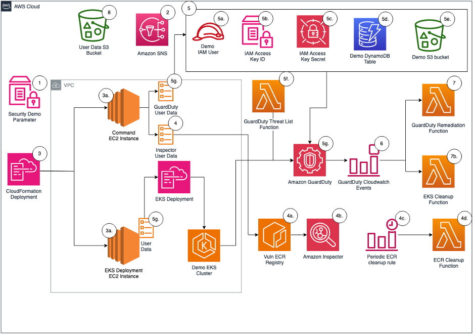

## Generate AWS Security Services findings

This CDK sample will that provisions resources to generate simulated security findings for actual provisioned resources within your AWS account. Generating simulated security findings in your AWS account gives your security team an opportunity to validate their cyber capabilities, investigation workflow and playbooks, escalation paths across teams, and exercise any response automation currently in place. 

## Prerequisites

1.	[Recommended] A separate AWS account containing no customer data or running workloads
2.	GuardDuty, along with GuardDuty Kubernetes Protection
3.	Amazon Inspector must be enabled
4.	[Optional] AWS Security Hub can be enabled to show a consolidated view of security findings generated by GuardDuty and Inspector

## Architecture

1.	User will specify the type of security findings to generate by passing a CloudFormation parameter.
2.	An SNS topic is created to subscribe to findings for notifications.  Subscribed users are notified of the finding through the deployed Amazon Simple Notification Service (Amazon SNS) topic.
3.	Upon user selection for the CloudFormation parameter, Amazon Elastic Compute Cloud (Amazon EC2) instance(s) are provisioned to run commands to generate security findings.
    <ol type="a">
    <li>Note: If the parameter of “inspector” is provided during deployment, only one EC2 instance will be deployed. If the parameter of “guardduty” is provided during deployment, two EC2 instances will be deployed.</li>
    </ol>
4.	For Amazon Inspector findings:
    <ol type="a">
    <li>EC2 user data creates a .txt file with vulnerable images, pulls down Docker images from open source vulhub, and creates an Amazon Elastic Container Registry (Amazon ECR) repository with the vulnerable images.</li>
    <li>EC2 user data pushes and tags the images in the ECR repository which will result in Amazon Inspector findings being generated</li>
    <li>An Amazon EventBridge cron-style trigger rule, inspector_remediation_ecr, invokes an AWS Lambda.</li>
    <li>The Lambda function, ecr_cleanup_function, will clean up the vulnerable images in the deployed ECR repository based on tags applied and sends a notification to the SNS topic.</li>
    Note: The ecr_cleanup_function Lambda function is also invoked as a custom resource to cleanup vulnerable images during deployment. If there are any issues with cleanup, the EventBridge rule will continually attempt to cleanup vulnerable images.
    </ol>
5.	For GuardDuty, the following actions are taken and resources are deployed:
<ol type="a">
  <li>An AWS Identity and Access Management (IAM) user named guardduty-demo-user is created with an IAM access key that is INACTIVE</li>
  <li>An AWS Systems Manager (SSM) parameter stores the IAM access key for guardduty-demo-user</li>
  <li>An AWS Secrets Manager secret stores the inactive IAM secret access key for guardduty-demo-user</li>
  <li>An Amazon DynamoDB table is created and the table name stored in a SSM parameter to be referenced within the EC2 user data</li>
  <li>An Amazon S3 Bucket is created and the bucket name is stored in a SSM parameter to be referenced within the EC2 user data</li>
  <li>An AWS Lambda function adds a threat list to Amazon GuardDuty that includes the IP addresses of the EC2 instances deployed as part of the sample</li>
  <li>EC2 user data will generate Amazon GuardDuty findings for:</li>
    <ol type="i">
    <li>Amazon Elastic Kubernetes Service (Amazon EKS)</li>
        <ol type="1">
            <li>Installs eksctl from GitHub</li>
            <li>Creates an EC2 key pair</li>
            <li>Creates an EKS cluster (dependent on availability zone capacity)</li>
            <li>Updates EKS cluster configuration to make a dashboard public</li>
        </ol>
    <li>DynamoDB</li>
        <ol type="1">
            <li>Adds an item to the DynamoDB table for “Joshua Tree”.</li>
        </ol>
    <li>EC2</li>
        <ol type="1">
            <li>Creates an AWS CloudTrail trail named guardduty-demo-trail-<GUID> and subsequently deletes the same CloudTrail trail. The <GUID> is randomly generated by using the $RANDOM function.</li>
            <li>Runs portscan on 172.31.37.171 (an RFC 1918 private IP address) and private IP of the “EKS Deployment EC2 instance” provisioned as part of the sample. Port scans are primarily used by bad actors to provide for potential vulnerabilities. The target of the port scans are internal IP addresses and do not leave the sample VPC deployed. </li>
            <li>Curls DNS domains that are labeled for bitcoin, command and control, and other domains associated with known threats</li>
        </ol>
    <li>S3</li>
        <ol type="1">
            <li>Disables Public Access Block and server access logging for the Amazon Simple Storage Service (Amazon S3) bucket provisioned as part of the solution.</li>
        </ol>
    <li>IAM</li>
        <ol type="1">
            <li>Deletes the account password policy and creates a password policy.</li>
        </ol>
    </ol>
  <li>Milk</li>
</ol>
6.	The following Amazon EventBridge rules are created:
    <ol type="a">
    <li>Note: If the parameter of “inspector” is provided during deployment, only one EC2 instance will be deployed. If the parameter of “guardduty” is provided during deployment, two EC2 instances will be deployed.</li>
    <li>guardduty_remediation_credexfil_rule – when a GuardDuty finding for InstanceCredentialExfiltration is created, a Lambda function is used to revoke the IAM role’s temporary security credentials and AWS permissions. Subscribed users are notified of the finding through the deployed SNS topic.</li>
    <li>guardduty_respond_IAMUser_rule – when a GuardDuty finding for IAM is created, subscribed users are notified through the deployed SNS topic. There is no remediation activity triggered by this rule.</li>
    <li>Guardduty_notify_S3_rule – when a GuardDuty finding for Amazon S3 is created, subscribed users are notified through the deployed SNS topic. There is no remediation activity triggered by this rule.</li>
    </ol>
7.	The following Lambda functions are created:
    <ol type="a">
    <li>guardduty_iam_remediation_function – the function will revoke all active sessions and send a notification to the SNS topic.</li>
    <li>eks_cleanup_function – the function will delete the EKS resources in the EKS CloudFormation template.</li>
        <ol type="i">
        <li>Note: Upon attempt to delete the overall sample CloudFormation stack, this will run to delete the EKS CloudFormation template.</li>
        </ol>
    </ol>
8.	An Amazon S3 bucket stores all the EC2 user data scripts ran from the EC2 instance(s)

## Build

To build this app, you need to be in the project root folder. Then run the following:

    $ npm install -g aws-cdk
    <installs AWS CDK>

    $ npm install
    <installs appropriate packages found in the package.json>

## Deploy

    $ cdk bootstrap aws://<INSERT_AWS_ACCOUNT>/<INSERT_REGION>
    <build S3 bucket to store files to perform deployment>

    $ cdk deploy SecurityFindingGeneratorStack –parameters securityserviceuserdata=inspector
    <deploys the cdk project into the authenticated AWS account>
    Note: allowed values for securityserviceuserdata are: [guardduty, inspector]

## Security

See [CONTRIBUTING](CONTRIBUTING.md#security-issue-notifications) for more information.

## License

This library is licensed under the MIT-0 License. See the LICENSE file.

